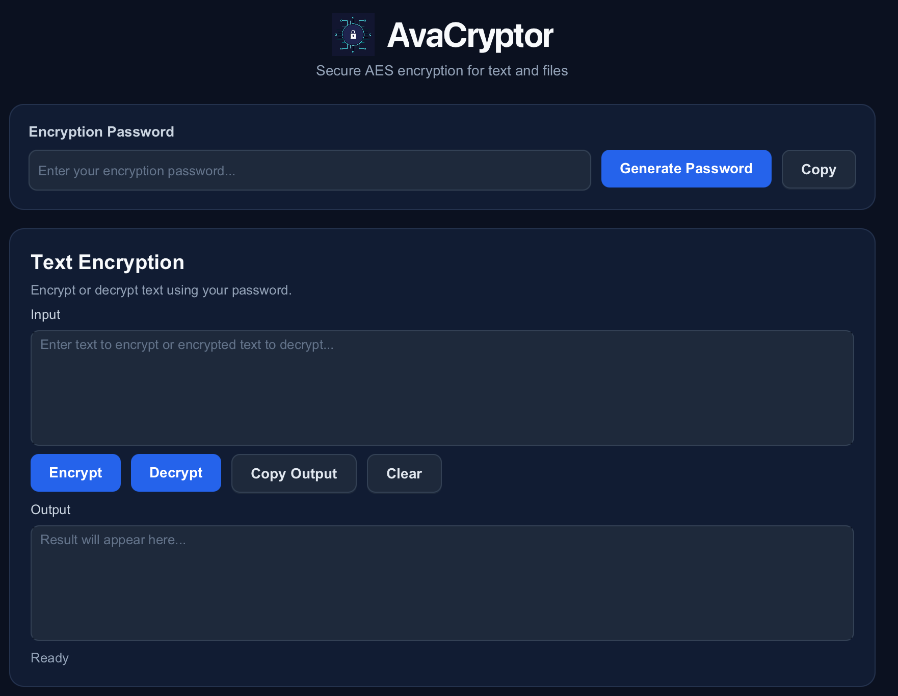
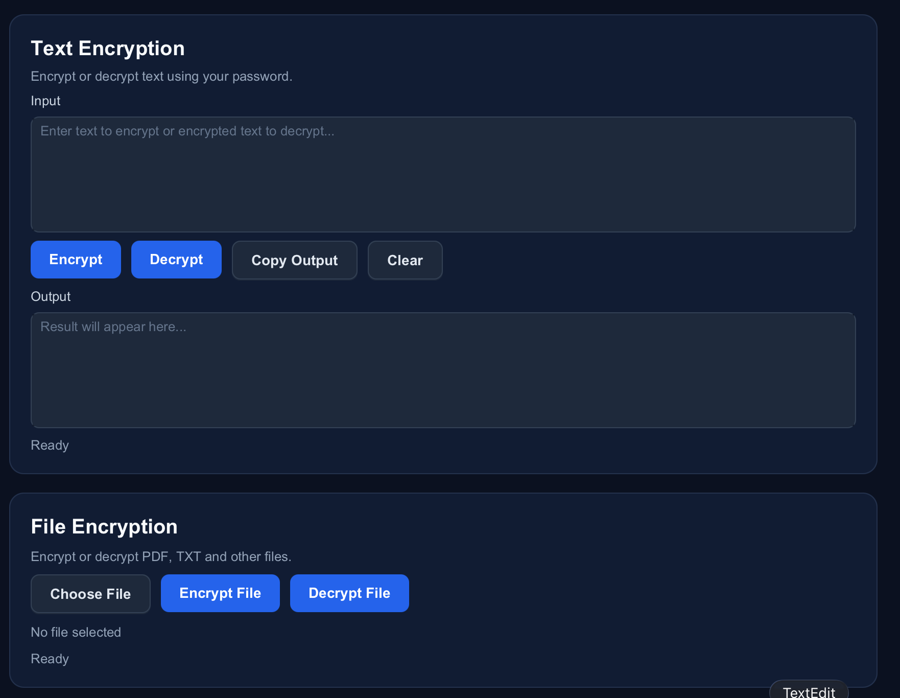

<h1 align="center">
  
   
</h1>

<h4 align="center">Secure AES Encryption & Decryption for Text and Files</h4>

  <a href="#Features">Features</a> •
  <a href="#Install">Install</a> •
  <a href="#Post-Installation">Post Installation</a> •
  <a href="#Usage">Usage</a> 
  

---

**AvaCryptor** is a JavaFX-based desktop application designed to securely encrypt and decrypt text and files using password-based AES encryption.

It provides a simple graphical interface for generating passwords, encrypting text, and protecting files such as PDFs and TXT documents. 

---

# Features

- Text Encryption: Encrypts and decrypts text using AES-GCM encryption with password-derived keys.
- File Encryption: Protects files such as PDFs, TXT documents, and other file types while preserving their original contents.
- Password Generation: Generates secure random passwords for use with encryption and provides a quick copy-to-clipboard option.
- Secure Key Derivation: Uses PBKDF2 with SHA-256 and a unique salt to derive encryption keys from passwords.
- Safe File Handling: Creates new encrypted and decrypted files with automatic numbering to prevent existing files from being overwritten.
- User-Friendly Interface: Provides a clean JavaFX graphical interface for managing text and file encryption from one application.

# Requirements

- Java 21
- Maven
- JavaFX 21.0.2 (managed automatically by Maven)

# Install

1. Install Java 21
2. Install Maven

# Post-Installation

3. Clone/download AvaCryptor
4. Open a terminal in the project directory
5. Run:

mvn clean javafx:run

# Usage

GUI based - Self Explanatory 

  
  

# Next Steps 

- create releases with exe and DMG
- give choice to user where to place modified file instead of same directory
